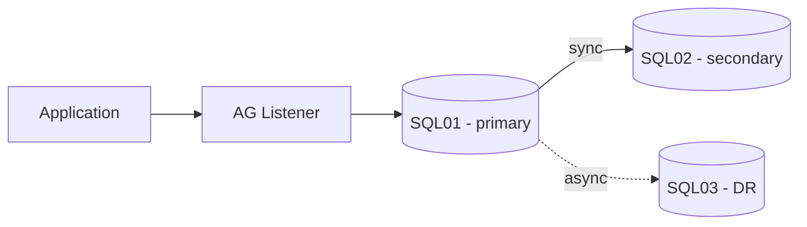
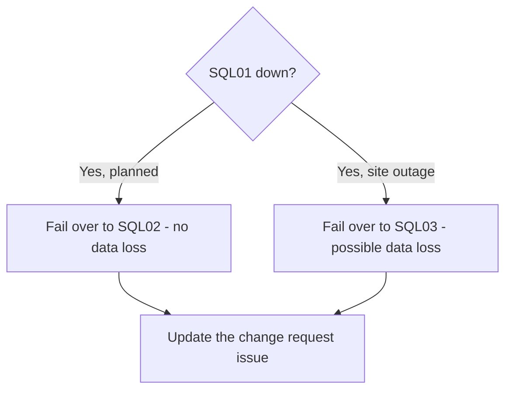

# Server Layout

Type this in any Markdown file and GitHub draws it.

```mermaid
flowchart LR
    App[Application] --> Listener[AG Listener]
    Listener --> SQL01[(SQL01 - primary)]
    SQL01 -- sync --> SQL02[(SQL02 - secondary)]
    SQL01 -. async .-> SQL03[(SQL03 - DR)]
```

## Who fails over to what

```mermaid
flowchart TD
    A{SQL01 down?} -->|Yes, planned| B[Fail over to SQL02 - no data loss]
    A -->|Yes, site outage| C[Fail over to SQL03 - possible data loss]
    B --> D[Update the change request issue]
    C --> D
```

## Backup windows

```mermaid
gantt
    title Nightly backup windows (Boston time)
    dateFormat HH:mm
    axisFormat %H:%M
    section SQL01
    Full backup      :01:00, 45m
    Index maintenance:02:00, 60m
    section SQL02
    Full backup      :03:00, 45m
    section Checks
    Backup check job :07:00, 5m
```
